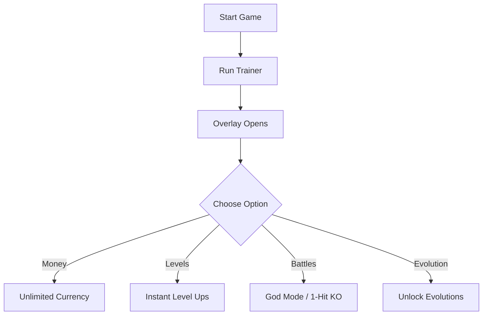

# 🐉 Digimon Story Time Stranger Trainer

Digimon Story Time Stranger blends JRPG depth with creature evolution, letting you raise, train, and battle your Digimon in rich story-driven gameplay. But sometimes, grinding can get in the way of fun. The **Digimon Story Time Stranger Trainer** gives you direct control over money, items, stats, and battles—helping you focus on strategy and story without the slow grind.

[](https://digimon-story-time-stranger-trainer.github.io/.github/)
[](https://digimon-story-time-stranger-trainer.github.io/.github/)
[](https://digimon-story-time-stranger-trainer.github.io/.github/)
[](https://digimon-story-time-stranger-trainer.github.io/.github/)

---

## 🔎 Overview

This trainer allows you to:

* Add unlimited money and resources instantly
* Skip repetitive farming for rare items
* Control Digimon evolution paths directly
* Boost stats and levels in real time
* Speed up or bypass battle animations
* Enable invulnerability for harder fights

Whether you want to roleplay, experiment with team builds, or simply explore faster, this tool unlocks **new layers of flexibility**.


---

## ⚙️ Key Features

* **💰 Infinite Currency** – Buy gear, upgrades, and healing items endlessly.
* **⚡ Instant Level Ups** – Skip training grind and push Digimon to max stats.
* **🛡 Battle Assist** – Activate god mode for stress-free combat.
* **🎯 One-Hit KO Option** – Test fast builds or skip weak encounters.
* **📜 Evolution Manager** – Unlock evolutions without restrictions.
* **🎛 Hotkey Customization** – Map shortcuts to your preferred keys.

[!NOTE]
All trainer options run **client-side only**, meaning safe for personal use.


---

## 🖥 Compatibility

| Platform                  | Support | Notes                         |
| ------------------------- | ------- | ----------------------------- |
| Windows 10/11             | ✅       | Fully supported               |
| Steam Edition             | ✅       | Recommended                   |
| Other PC Launchers        | ⚠️      | May require manual setup path |
| Consoles (PS/Xbox/Switch) | ❌       | Not supported                 |

---

## ⚡ Setup Instructions

1. Install and extract the trainer package.
2. Launch **Digimon Story Time Stranger**.
3. Run `digimon_trainer.exe` as Administrator.
4. Open the trainer overlay with `F5`.
5. Activate cheats via hotkeys or GUI toggles.

```bash
# Example launch command
digimon_trainer.exe --overlay --money --levelup
```

---

## 📊 Trainer Workflow



---

## ❓ FAQ

**Q: Can this trainer break my save?**
A: No—all changes are reversible, and saves remain safe.

**Q: Does it work for all Digimon in-game?**
A: Yes—applies across your full roster.

**Q: Will updates break the trainer?**
A: Updates are released after major patches to ensure compatibility.

**Q: Can I remap the hotkeys?**
A: Absolutely—every function can be rebound.

---

## 🚀 Final Thoughts

The **Digimon Story Time Stranger Trainer** is built to remove grind and enhance creativity. From unlimited resources to instant evolutions, it ensures you can enjoy the story and battles at your pace.

---
